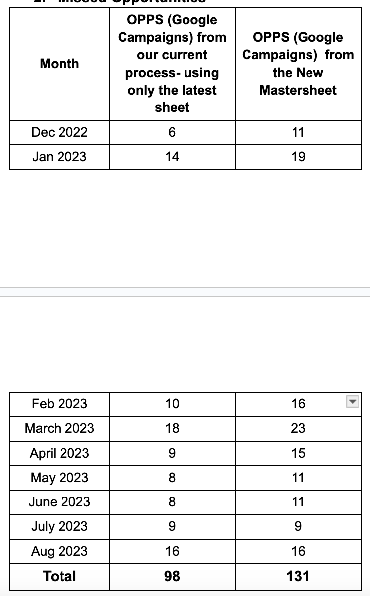
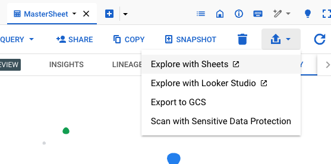
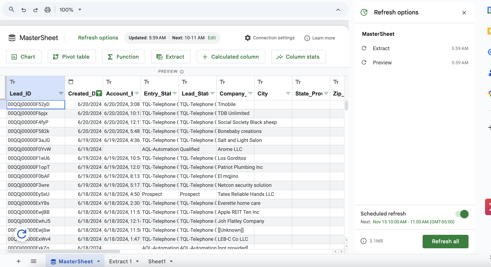
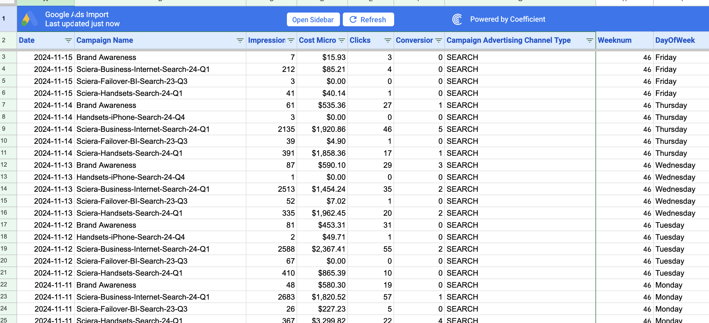
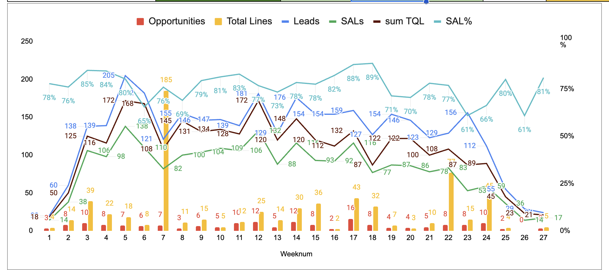
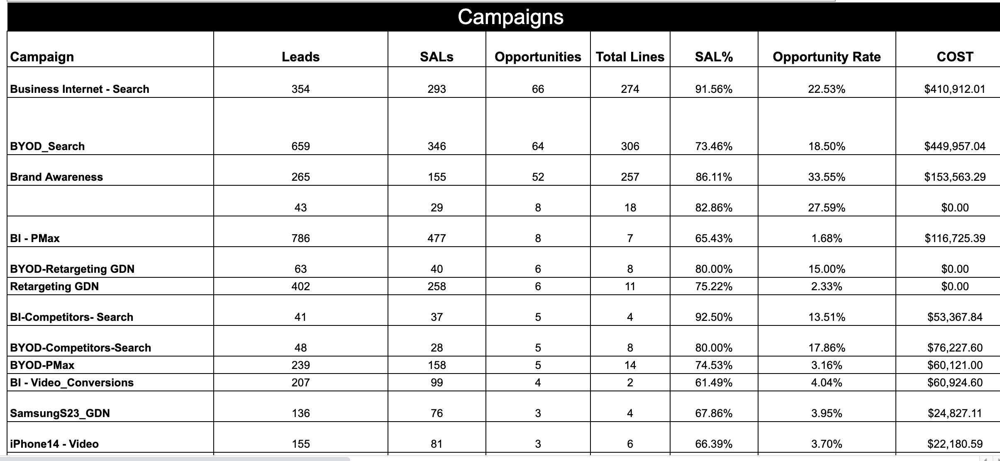

[PORTFOLIO_HOME](https://satyjais.github.io/)


## Data Cleaning & ETL Automation using BigQuery (SQL) & Google Sheets
Campaign report - data streamlining &amp; automation project 
# Business Background -
I was the account manager/ digital marketing consultant for a major telecom player in the US. The client commissioned us to run display (programmatic) and Google ads (search, display, video) for their B2B division. The key KPIs for the project were Cost per Lead, SQLs, and Cost per Opportunity.

# Problem Statement - 
The existing Client Campaign Data workflow was broken. It was prone to errors, missing data points, and too many manual steps, and it was time-consuming and inefficient. There were multiple data sources and for every report, the team needed to fetch data from various sources and create a new Excel/Google sheet every time resulting in duplicate data, redundant efforts and errors. Bottomline - **The process was missing the "Single Source of Truth"**. And when we missed datapoints, it affected our reported metrics, showing a performance lower than actual.

# Issues in the existing data management & reporting system - 
- The leads coming in from the client were not recorded as per their LeadID or any primary key
- The older leads were not getting updated after a period. Let’s say if a lead from June is disqualified in August or converts into an opportunity later, it may not get updated in our systems. Or if an opportunity added more lines later, there was a high chance that we would miss that update, as a result under-reporting our WINs.
- Leads/opportunities from **Inbound calls, chatbot, Calendly** didn’t have campaign (UTM) tags every time they come into the sheets. The client has to add the tags manually in the sheets a few times a month, but the same leads may not have any tags in the subsequent sheets
In short, the data was not dynamically updated.


# As a result, data discrepancies creep in. For example - 

- Missing Leads -
  - Leads (all sources) in the CRM sheets (Jan- 17 Sep 2023) - 3061
  - Leads (all sources) in the most recent sheet (Jan- 17 Sep 2023)  - 2978
- Missed Opportunities -
  - ~25% error in the existing system.
Example - Discrepancies in Data (what was reported vs actuals)-



## To fix these issues and create an error-proof unified system, automation was needed - A continuously updated & living "Source of Truth"
_# A system where each lead is stored in a unified sheet, all previous leads are updated on the relevant attributes, and there is no data loss._

1. **Automating workflows**
2. **data integrity**
3. **working with latest & most relevant data**

## Proposed data workflow (ETL process) - 


## EXTRACT

### Step 1 - Creating the mastersheet table
```sql
Create Table
  `.....Sheets.MasterSheet`
(Lead_ID STRING,
Created_Date DATE,
Account_Engagement_Created_Date STRING,
Entry_Status STRING,
Lead_Status STRING,
Company___Account STRING,
City STRING,
State_Province STRING,
Zip_Postal_Code STRING,
utm_source STRING,
utm_medium STRING,
utm_campaign STRING,
Google_Analytics_Source STRING,
Google_Analytics_Medium STRING,
Google_Analytics_Campaign STRING,
Google_Analytics_Content STRING,
Google_Analytics_Term STRING,
Disqualified_Reason STRING,
Primary_Source STRING,
Stage STRING,
Total_Lines INTEGER,
Handset_Qty INTEGER,
IoT_Qty INTEGER,
Connected_Device_Qty INTEGER,
No__of_Employees INTEGER)
```
  

### Step 2 - Populating Master sheet (with the first sheet)

```sql
INSERT INTO
  `.....Sheets.MasterSheet`
SELECT
  Lead_ID,
  Created_Date,
  Account_Engagement_Created_Date,
  Entry_Status,
  Lead_Status,
  Company___Account,
  City,
  State_Province,
  Zip_Postal_Code,
  utm_source,
  utm_medium,
  utm_campaign,
  Google_Analytics_Source,
  Google_Analytics_Medium,
  Google_Analytics_Campaign,
  Google_Analytics_Content,
  Google_Analytics_Term,
  Disqualified_Reason,
  Primary_Source,
  Stage,
  Total_Lines,
  Handset_Qty,
  IoT_Qty,
  Connected_Device_Qty,
  No__of_Employees
FROM
  `....Sheets.May_17_2023`
```

### Step 3 - Updating Mastersheet with New CRM data sheet (recurring)

```sql
UPDATE
`dataanalytics-2023-394903.USCC_Leads_CRM_Sheets.MasterSheet` AS M
SET
M.Lead_Status = N.Lead_Status,
M.Disqualified_Reason = N.Disqualified_Reason,
M.Stage = N.Stage,
M.Total_Lines = N.Total_Lines,
M.Handset_Qty = N.Handset_Qty,
M.IoT_Qty = N.IoT_Qty,
M.utm_source = IFNULL(M.utm_source,N.utm_source),
M.utm_medium = IFNULL(M.utm_medium,N.utm_medium),
M.utm_campaign = IFNULL(M.utm_campaign,N.utm_campaign),
M.Connected_Device_Qty = N.Connected_Device_Qty
FROM
`dataanalytics-2023-394903.USCC_Leads_CRM_Sheets.Sep_27_2023` AS N
WHERE
M.Lead_ID = left(N.Lead_ID,15)
```
### Step 4 - Inserting (APPENDING) new rows from the new sheet into master sheet (recurring)

```sql 
INSERT INTO
`.....Sheets.MasterSheet`
SELECT
Left(Lead_ID,15),
Created_Date,
Account_Engagement_Created_Date,
Entry_Status,
Lead_Status,
Company___Account,
City,
State_Province,
Zip_Postal_Code,
utm_source,
utm_medium,
utm_campaign,
Google_Analytics_Source,
Google_Analytics_Medium,
Google_Analytics_Campaign,
Google_Analytics_Content,
Google_Analytics_Term,
Disqualified_Reason,
Primary_Source,
Stage,
Total_Lines,
Handset_Qty,
IoT_Qty,
Connected_Device_Qty,
No__of_Employees
FROM
`.....Sheets.Sep_27_2023` AS N
WHERE NOT EXISTS
(
SELECT
Lead_ID,
Created_Date,
Account_Engagement_Created_Date,
Entry_Status,
Lead_Status,
Company___Account,
City,
State_Province,
Zip_Postal_Code,
utm_source,
utm_medium,
utm_campaign,
Google_Analytics_Source,
Google_Analytics_Medium,
Google_Analytics_Campaign,
Google_Analytics_Content,
Google_Analytics_Term,
Disqualified_Reason,
Primary_Source,
Stage,
Total_Lines,
Handset_Qty,
IoT_Qty,
Connected_Device_Qty,
No__of_Employees
FROM
`dataanalytics-2023-394903.USCC_Leads_CRM_Sheets.MasterSheet`
WHERE
Lead_ID = left(N.Lead_ID,15)
)
```
## Transform

### Step 5 - Data Cleaning & Transformation
 - In some Client sheets Lead_Id (the primary key) is 18 chars long while other sheets have 15 Chars as the length - mapping the first 15 chars in all cases works
 - Missing utm tag fields where Google tags are present.


**Merging Two columns to avoid NULL values in the Google Tags(Source, Medium, Campaign) values**

```sql
UPDATE
 `dataanalytics-2023-394903.USCC_Leads_CRM_Sheets.MasterSheet`
 SET
 utm_source=coalesce(utm_source,Google_Analytics_Source),
 utm_medium=coalesce(utm_medium,Google_Analytics_Medium),
 utm_campaign=coalesce(utm_campaign,Google_Analytics_Campaign)
 WHERE
 utm_source Like 'google'
```

**Cleaning & Replacing Blank UTM_Campaign with Google_Campaign**
``` sql
​​update
`dataanalytics-2023-394903.USCC_Leads_CRM_Sheets.MasterSheet`
set
utm_campaign = Google_Analytics_Campaign
WHERE
utm_source like 'google'
AND
utm_campaign = ''
```


**Load the sheet to a dynamic Google Sheet for analysis & reporting -**


**Connected Sheet is ready with data -**



**Streaming Google Ads data via a Chrome extension : Coefficient -**



## Load

```
=importrange("1xad-3kfzmFDzjxLdkrFDIm-fE_kkDYn_2tVJCe6iQFY","Extract 1!A:Y")
```

```
Query(MasterData_CRM_Leads!$A:$AB,"select count(A) where J contains 'google' AND Not K contains 'organic' AND B >= date'"&TEXT(B3,"yyyy-mm-dd")&"' AND (S = 'Website' OR S contains 'google') AND B <= date'"&text(C3,"yyyy-mm-dd")&"' AND Not L contains 'bi_failover_sciera_23_q3_pmax' Label count(A) 'Formfills'",1)
```


## Bringing the data from both sources to create a dynamic dashboard


**Example visualization 1**


**Example Visualization 2**

